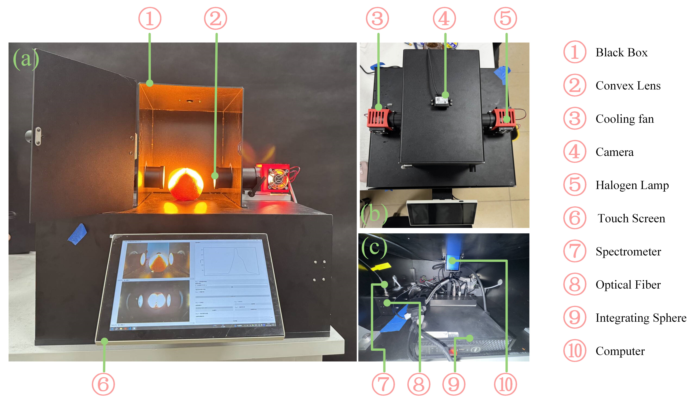

# HashNIRL

## 🧪 In-House Deployment

To demonstrate the practical applicability of the proposed method, a self-developed spectra acquisition instrument was constructed, and the HashNIRL framework was deployed on it for real-world validation, as shown below:



---

## 🔧 Environment Setup

To run the code successfully, please set up the environment by installing all required dependencies:

```
conda env create -f environment.yaml
```

This will create a new Conda environment with the necessary packages.

---

## 📦 Reproducing Results
Below is a brief introduction to the commands used to run different models in our codebase.

### 💡 A Simple Example of HashNIRL
Run HashNIRL on the `Chunjian_area` Dataset:
```
python main.py --dataset Chunjian_area --batch_size 64 --lr 0.0005 --threshold 0.05 --window_size 2 --rate 0.75 --batch_rate 0.1 --drop_rate 0.4 --epochs 10 --invMod_coe 1 --invCont_coe 1.6
```

### To obtain results of ERM
Simply run
```
python main.py --model 1dcnn
```
with corresponding datasets and model specifications.

### Running with the baselines:
- To test with invarTSmodel, simply run `python main.py --model invartsmodel`
- To test with DivIL, simply run `python baseline_models/DivIL/NIROOD/NIR_DivIL.py`
- To test with MSGNet, simply run `python baseline_models/MSGNet/run_longExp.py`
- To test with OOD-TV-IRM, simply run `python baseline_models/OOD-TV-IRM/OOD-TV/OOD-TV_NIR/main.py`
- To test with invariant learning baselines, specify `--num_envs=2` and use `--irm_opt` to be `irm`, `vrex`, `eiil` or `ib-irm` to specify the methods.

